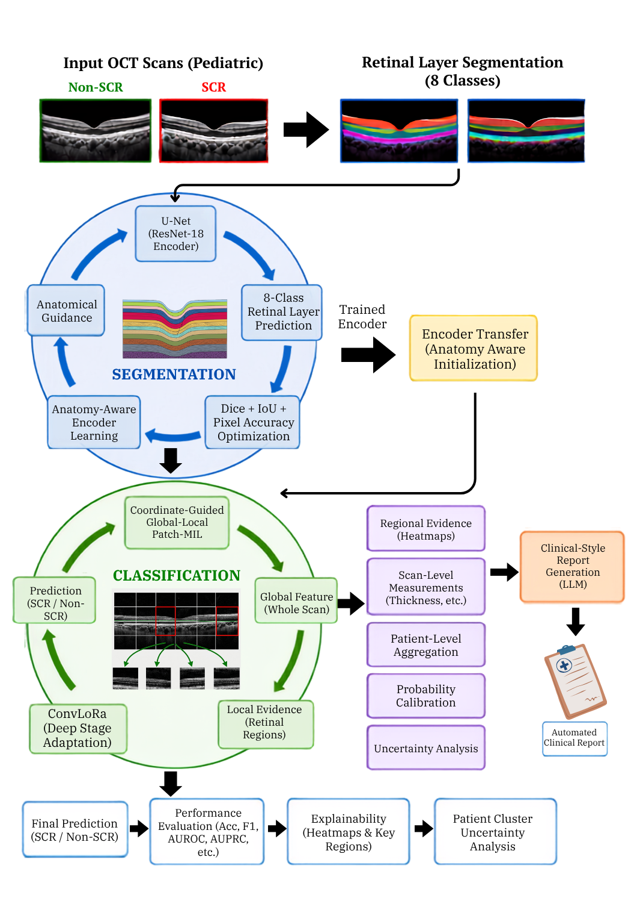
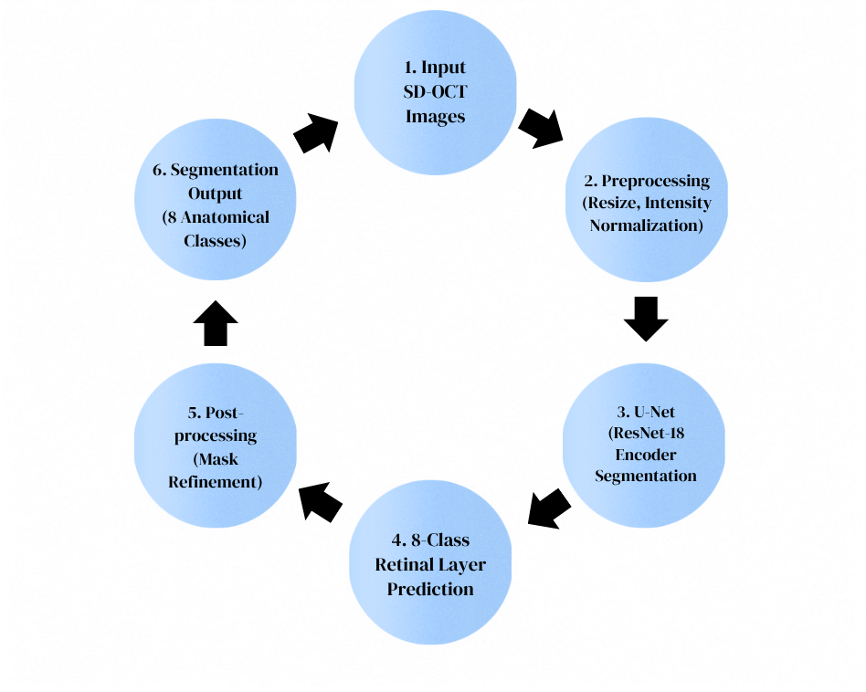
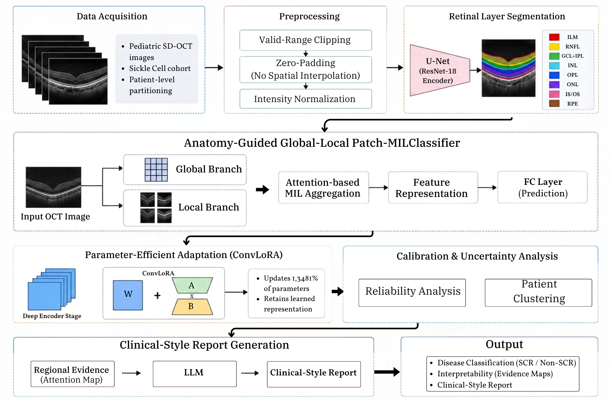

# Anatomy-Guided and Parameter-Efficient Deep Learning for Pediatric Sickle Cell Retinopathy Assessment Using Structural OCT

Official implementation of:

**An Anatomy-Guided and Parameter-Efficient Deep Learning Framework for Interpretable Pediatric Sickle Cell Retinopathy Assessment Using Structural OCT**

This repository contains the implementation of an anatomy-guided deep learning framework for automated assessment of pediatric sickle cell retinopathy (SCR) from structural optical coherence tomography (OCT).

The proposed approach combines retinal anatomical representation learning, global–local disease classification, parameter-efficient adaptation, regional evidence analysis, patient-level assessment, uncertainty estimation, and structured clinical-style reporting within a unified computational framework.

---

## Overview

Sickle cell retinopathy can produce subtle structural retinal abnormalities before advanced ocular manifestations become clinically apparent.

To incorporate retinal anatomy into disease recognition, the proposed framework first learns retinal-layer structure through anatomical segmentation. The resulting encoder is subsequently transferred to an SCR classification network, allowing disease recognition to begin from retina-specific rather than purely generic visual representations.

The complete framework consists of four principal stages:

1. Retinal-layer anatomical pretraining
2. Anatomy-aware global–local SCR classification
3. ConvLoRA-based parameter-efficient refinement
4. Interpretation, uncertainty analysis, and structured report generation

---

## Proposed Framework

<p align="center">
  
</p>

<p align="center">
  <b>Figure 1.</b> Overview of the proposed pediatric SCR assessment framework.
</p>

Structural OCT images first undergo morphology-preserving preprocessing. A retinal-layer segmentation network is then trained to learn anatomical organization and spatial relationships within the retina.

Following anatomical pretraining, the segmentation decoder is removed and the learned ResNet-18 encoder is transferred to the disease-classification stage.

The downstream classifier combines whole-image retinal context with localized retinal evidence using a coordinate-guided global–local Patch-MIL architecture. Available SCR annotations are used only during training to support regional evidence learning.

ConvLoRA is subsequently introduced into the deeper encoder layers to perform disease-specific refinement while updating only a small proportion of the complete model parameters.

The final framework supports scan-level prediction, patient-level aggregation, probability calibration, uncertainty estimation, regional evidence visualization, and constrained clinical-style reporting.

---

## Retinal-Layer Anatomical Pretraining

<p align="center">
  
</p>

<p align="center">
  <b>Figure 2.</b> Retinal-layer segmentation and anatomy-pretraining workflow.
</p>

An eight-class U-Net with a ResNet-18 encoder is trained to learn retinal anatomy before SCR classification.

The segmentation dataset contains:

- 220 structural OCT images
- 8 retinal anatomical classes
- Original image resolution of 216 × 500 pixels
- 154 training images
- 33 validation images
- 33 independent test images

Images and masks are zero-padded to 224 × 512 pixels while preserving the original retinal geometry.

Training combines weighted cross-entropy and multiclass Dice supervision. The best segmentation model is selected using validation performance, after which the trained encoder is transferred to the SCR classifier.

### Segmentation Performance

| Metric | Result |
|---|---:|
| Test Loss | 0.0814 |
| Cross-Entropy Loss | 0.0917 |
| Dice Loss | 0.0658 |
| Foreground Mean Dice | **0.9489** |
| Foreground Mean IoU | **0.9034** |
| All-Class Mean Dice | 0.9548 |
| Pixel Accuracy | **0.9807** |

---

## Anatomy-Aware Global–Local Classification

<p align="center">
  
</p>

<p align="center">
  <b>Figure 3.</b> Complete anatomy-guided Patch-MIL and ConvLoRA architecture.
</p>

The segmentation-trained ResNet-18 encoder is transferred to the disease-classification network to provide anatomy-aware initialization.

The SCR classifier operates on structural OCT images at their native 256 × 576 pixel resolution.

Features extracted from multiple encoder depths are combined to form a multiscale retinal representation. Classification is then performed using two complementary sources of information:

- global structural context from the complete OCT scan;
- localized retinal evidence from spatial feature regions.

This global–local strategy enables the model to consider both the overall organization of the retina and smaller disease-relevant structural patterns.

---

## Coordinate-Guided Regional Learning

Available rectangular SCR annotations are used as weak regional guidance during training.

The annotations are not interpreted as dense lesion masks. Instead, they provide approximate spatial information that helps the model distinguish disease-relevant retinal regions from background regions.

During inference, annotation coordinates are not required.

The trained model independently identifies influential retinal regions and generates regional evidence maps associated with the final SCR prediction.

These evidence maps represent model-derived decision support and should not be interpreted as clinically verified lesion boundaries.

---

## Parameter-Efficient ConvLoRA Refinement

Following development of the base global–local classifier, convolutional low-rank adaptation is introduced into the deepest encoder stage.

The main pretrained convolutional parameters remain frozen while a small set of low-rank adaptation parameters is optimized for SCR-specific refinement.

The configuration used in the proposed framework includes:

- ConvLoRA rank: 8
- Scaling factor: 16
- Adaptation applied to five convolutional layers
- Only ConvLoRA parameters trainable during the refinement stage

### Parameter Efficiency

| Parameter Category | Count | Percentage |
|---|---:|---:|
| Frozen V4 Parameters | 12,289,154 | 98.6519% |
| Trainable ConvLoRA Parameters | **167,936** | **1.3481%** |
| Final Model Parameters | 12,457,090 | 100.0000% |

This design allows disease-specific adaptation while preserving the majority of the retinal representation learned during anatomical pretraining and disease classification.

---

## Datasets

Two publicly available datasets are used in this study.

### Retinal-Layer Segmentation Dataset

This dataset is used exclusively for retinal anatomical pretraining.

The implementation uses:

- `resized_images.npy`
- `resized_labeledimages.npy`

The dataset contains 220 structural OCT images paired with pixel-level retinal-layer annotations.

It is used only to learn anatomical retinal representations and is not used as the primary SCR classification dataset.

### CSAT Pediatric SCR Dataset

The CSAT dataset is used for SCR classification, coordinate-guided regional learning, patient-level assessment, and final evaluation.

The audited dataset contains:

- 12,623 structural OCT records
- 102 pediatric patients
- Scan-level SCR and non-SCR labels
- Patient identifiers
- Available rectangular SCR annotations

### Patient-Independent Data Distribution

| Split | Patients | Original Scans | Final Balanced Scans |
|---|---:|---:|---:|
| Training | 71 | 9,177 | 3,758 |
| Validation | 15 | 1,679 | 778 |
| Locked Test | 16 | 1,767 | 1,112 |
| **Total** | **102** | **12,623** | **5,648** |

All scans belonging to the same patient remain within a single partition.

No patient overlap occurs between the training, validation, and test sets.

A secondary natural-distribution evaluation is performed using all quality-controlled scans from the same held-out test patients without image-level class balancing.

This evaluation contains:

- 1,764 OCT scans
- 1,207 non-SCR scans
- 557 SCR scans

---

## OCT Preprocessing

Preprocessing is intentionally conservative to preserve retinal morphology.

The pipeline includes:

- grayscale processing;
- scanner-border suppression;
- preservation of the original retinal structure;
- no aggressive enhancement or sharpening;
- no disease-specific image transformation;
- no anatomical cropping;
- three-channel representation for encoder compatibility;
- ImageNet normalization;
- morphology-preserving horizontal reflection during training.

Validation and test inference use both the original OCT image and its horizontally reflected representation.

---

## Experimental Configuration

| Component | Configuration |
|---|---|
| Computing Platform | Google Colab |
| GPU | NVIDIA L4 |
| Deep Learning Framework | PyTorch |
| CUDA Acceleration | Enabled |
| Numerical Precision | Mixed Precision |
| Random Seed | 42 |
| Optimizer | AdamW |
| Segmentation Input Size | 224 × 512 |
| Classification Input Size | 256 × 576 |

### Training Configuration

| Model | Batch Size | Maximum Epochs | Selected Epoch | Initial Learning Rate |
|---|---:|---:|---:|---:|
| Retinal-Layer U-Net | 4 | 30 | 28 | 0.0003 |
| V4 Patch-MIL | 12 | 35 | 7 | 0.0002 |
| V4-ConvLoRA | 16 | 5 | 1 | 0.00002 |

---

## Classification Performance

### Balanced Patient-Independent Locked-Test Set

| Metric | V4-ConvLoRA |
|---|---:|
| Accuracy | **0.9164** |
| Precision | **0.9248** |
| Recall / Sensitivity | **0.9065** |
| Specificity | **0.9263** |
| F1 Score | **0.9155** |
| AUROC | **0.9610** |
| Average Precision | **0.9671** |
| Brier Score | 0.0700 |
| MCC | 0.8329 |

### Locked-Test Confusion Matrix

| | Predicted Non-SCR | Predicted SCR |
|---|---:|---:|
| **True Non-SCR** | **515** | **41** |
| **True SCR** | **52** | **504** |

---

## Natural-Distribution Evaluation

The final model is additionally evaluated using all quality-controlled OCT scans from the same held-out patient cohort without image-level class balancing.

| Metric | Result |
|---|---:|
| Accuracy | **0.9195** |
| Precision | 0.8487 |
| Recall | **0.9066** |
| Specificity | **0.9254** |
| F1 Score | 0.8767 |
| AUROC | **0.9630** |
| Average Precision | 0.9378 |
| Brier Score | 0.0597 |
| MCC | 0.8180 |

### Natural-Distribution Confusion Matrix

| | Predicted Non-SCR | Predicted SCR |
|---|---:|---:|
| **True Non-SCR** | **1117** | **90** |
| **True SCR** | **52** | **505** |

The natural-distribution analysis uses the same held-out patients and final trained model without introducing a new cohort or retraining the classifier.

---

## Patient-Level Assessment

When multiple OCT scans are available for the same patient, scan-level probabilities are aggregated to provide a patient-level assessment.

The framework also evaluates agreement among scans belonging to the same patient, providing an additional measure of prediction consistency.

This enables interpretation at both the individual-scan and patient levels.

---

## Uncertainty Analysis

Uncertainty is estimated using patient-cluster bootstrap resampling.

Scans belonging to the same patient remain grouped during bootstrap sampling, avoiding the assumption that multiple scans from one patient are statistically independent.

The evaluation uses 1,000 patient-cluster bootstrap repetitions to estimate uncertainty around the major classification metrics.

---

## Regional Evidence Visualization

The global–local classifier produces spatial patch scores that identify retinal regions contributing most strongly to the model prediction.

These responses are projected back to the OCT image to create interpretable regional evidence maps.

The visualizations are intended to support model interpretation and do not represent clinically verified lesion-segmentation masks.

---

## Clinical-Style Report Generation

The reporting module receives verified outputs from the final V4-ConvLoRA classifier.

Structured inputs may include:

- predicted OCT pattern;
- scan-level probability;
- patient-level probability;
- prediction confidence;
- scan agreement;
- strongest regional evidence;
- evidence concentration;
- image-quality information.

A locally integrated FLAN-T5-small model converts these structured variables into a concise clinical-style explanation.

The language-generation stage is constrained to the supplied model outputs and is designed to avoid unsupported patient information, disease staging, treatment recommendations, or additional clinical claims.

A deterministic reporting template is available as a fallback when language generation is unavailable.

The reporting component presents the model findings and does not alter the underlying classification result.

---

## Repository Structure

```text
.
├── 01_dataset_preparation.py
├── 02_methodology_training.py
├── 03_experiments_evaluation.py
├── figures/
│   ├── Figure_1_Overall_Framework.png
│   ├── Figure_2_Retinal_Layer_Segmentation.png
│   └── Figure_3_Complete_Architecture.png
└── README.md
